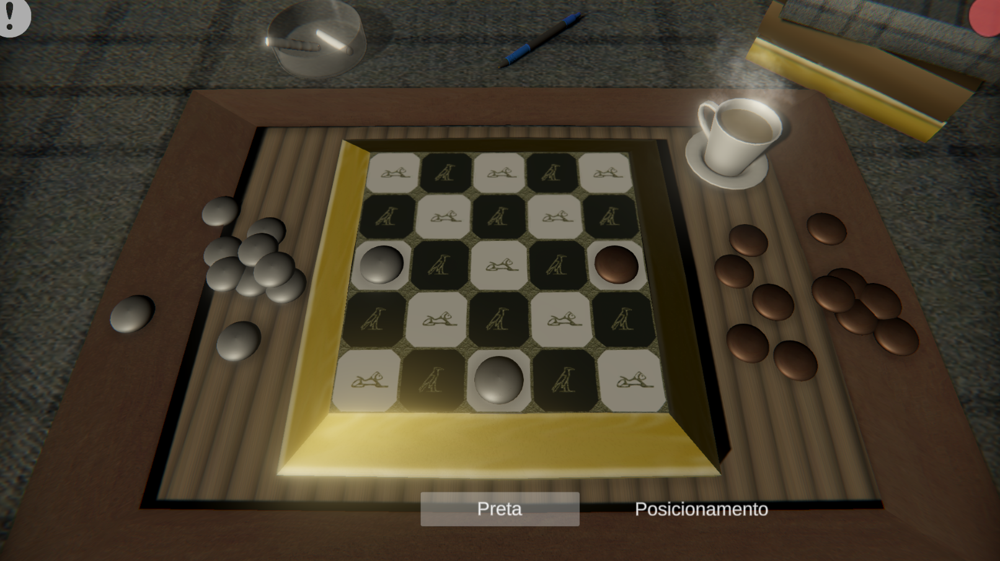

# Seega
an African board game, Created in partnership with IFMS

The objective of this project was to expose the african culture through its games, the project was presented as a lecture at IFMS on Brazil.

