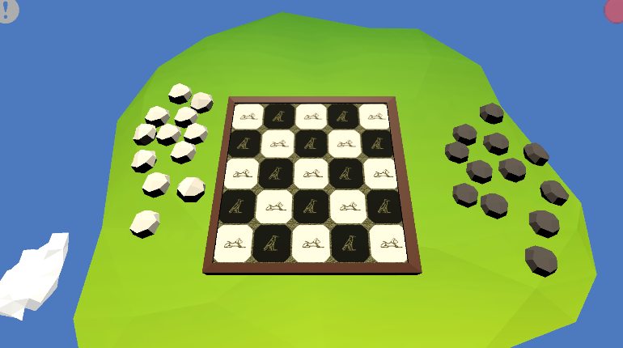

# Seega
an African board game, Created in partnership with IFMS

The objective of this project was to expose the african culture through its games, the project was presented as a lecture at IFMS on Brazil. Featuring decoupling as a proof of concept in Unity.

### Features
Seega Game [X]

AI [ ]

Online/Local [ ]

Other Game Modes [ ]

### Technical Features

-Event Manager [X]

-Dependecy Injection (Zenject) [X]

-Game Object Caching [X]

-Pooling [ ]

